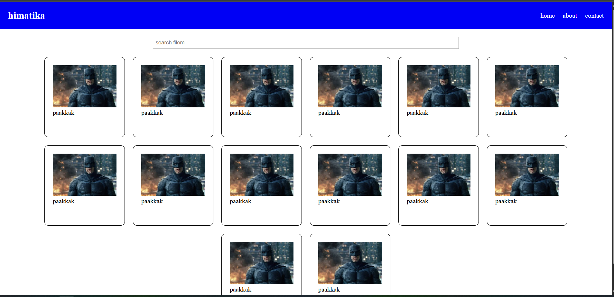

## membuta web list filem sederhanah



- html

```html

index.html

<!DOCTYPE html>
<html lang="en">
<head>
  <meta charset="UTF-8">
  <meta name="viewport" content="width=device-width, initial-scale=1.0">
  <title>pertemuan 3</title>
  <link rel="stylesheet" href="style.css">
</head>
<body>
  <!-- navabr -->
    <nav class="navbar">
      <h1>himatika</h1>
      <div class="item-navbar">
        <a>home</a>
        <p class="link" href="./about.html">about</p>
        <p>contact</p>
      </div>
    </nav>
    <!-- search -->
     <div>
      
     </div>
     <!-- search -->
      <div class="search">
        <input type="text" class="inputan" placeholder="search filem">
      </div>
    <!-- filem -->
     <div class="container">
      <div class="item-container">
        <div class="gamabar">
          
        </div>
        <p>paakkak</p>
      </div>
      <div class="item-container">
        <div class="gamabar">
          
        </div>
        <p>paakkak</p>
      </div>
      <div class="item-container">
        <div class="gamabar">
          
        </div>
        <p>paakkak</p>
      </div>
      <div class="item-container">
        <div class="gamabar">
          
        </div>
        <p>paakkak</p>
      </div>
      <div class="item-container">
        <div class="gamabar">
          
        </div>
        <p>paakkak</p>
      </div>
      <div class="item-container">
        <div class="gamabar">
          
        </div>
        <p>paakkak</p>
      </div>
      <div class="item-container">
        <div class="gamabar">
          
        </div>
        <p>paakkak</p>
      </div>
      <div class="item-container">
        <div class="gamabar">
          
        </div>
        <p>paakkak</p>
      </div>
      <div class="item-container">
        <div class="gamabar">
          
        </div>
        <p>paakkak</p>
      </div>
      <div class="item-container">
        <div class="gamabar">
          
        </div>
        <p>paakkak</p>
      </div>
      <div class="item-container">
        <div class="gamabar">
          
        </div>
        <p>paakkak</p>
      </div>
      <div class="item-container">
        <div class="gamabar">
          
        </div>
        <p>paakkak</p>
      </div>
      <div class="item-container">
        <div class="gamabar">
          
        </div>
        <p>paakkak</p>
      </div>
      <div class="item-container">
        <div class="gamabar">
          
        </div>
        <p>paakkak</p>
      </div>
     </div>
  </body>
</html>

```

```html
about.html

<!DOCTYPE html>
<html lang="en">
<head>
  <meta charset="UTF-8">
  <meta name="viewport" content="width=device-width, initial-scale=1.0">
  <title>abaot</title>
</head>
<body>
  <h1>halo world</h1>
</body>
</html>

```

- css

```css

*{
  margin: 0;
  padding: 0;
  box-sizing: border-box;
}

.navbar {
  display: flex;
  align-items: center;
  justify-content: space-between;
  padding: 20px;
  background-color: blue;
  gap: 20px;
  color: white;
}

.item-navbar {
  display: flex;
  gap: 20px;
}

.container {
  padding: 20px;
  display: flex;
  flex-wrap: wrap;
  gap: 20px;
  justify-content: center;
}

.item-container {
  border: 1px solid black;
  width: 200px;
  height: 200px;
  border-radius: 10px;
  padding: 20px;
}

.gamabar {
  width: 100%;
  overflow: hidden;
}

.img {
  width: 100%;
  height: 100%;
  object-fit: cover;
}


.inputan {
  width: 50%;
  margin-top: 20px;
  padding: 5px;
}

.search {
  display: flex;
  justify-content: center;
}

.link {
  cursor: pointer;
  color: white;
  text-decoration: none;
}

```