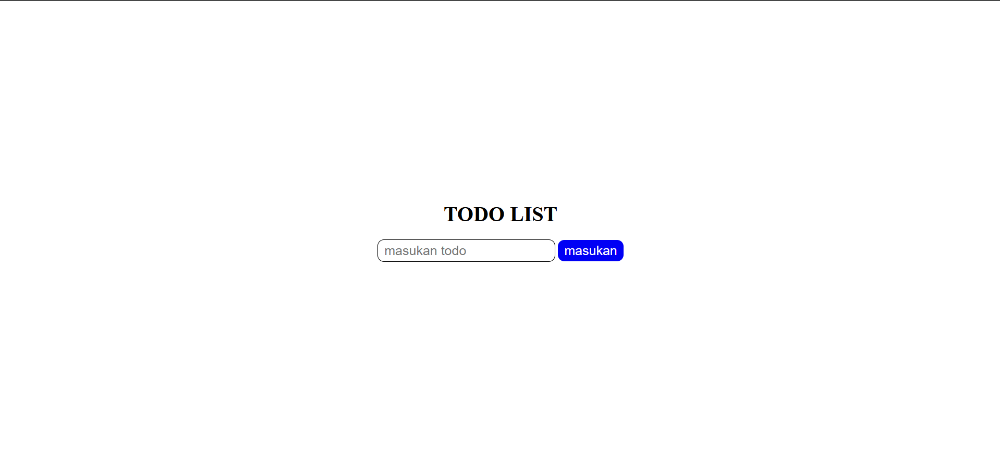

# latihan membuat TODO sederhanah

## contoh



- html

buat file baru yaitu index.html

```html

<!DOCTYPE html>
<html lang="en">
  <head>
    <meta charset="UTF-8" />
    <meta name="viewport" content="width=device-width, initial-scale=1.0" />
    <title>Document</title>
    <link rel="stylesheet" href="./style.css" />
  </head>
  <body>
    <div class="container">
      <h1 class="title">TODO LIST</h1>
      <div>
        <input class="input_text" id="input_text" type="text" placeholder="masukan todo" />
        <button class="btn_input" id="btn_input">masukan</button>
      </div>
      <ol id="ol"></ol>
    </div>

    <script src="./script.js"></script>
  </body>
</html>

```

- css

buat file baru yaitu file style.css


```css

* {
  margin: 0;
  padding: 0;
}

.container {
  display: flex;
  width: 100%;
  height: 100vh;
  justify-content: center;
  flex-direction: column;
  align-items: center;
  gap: 20px;
}

.input_text {
  padding: 5px 10px;
  font-size: 20px;
  border-radius: 10px;
  outline: none;
  border: 1px solid black;
}

.btn_input {
  padding: 5px 10px;
  font-size: 20px;
  cursor: pointer;
  background-color: blue;
  border: none;
  color: white;
  border-radius: 10px;
}


```

- js atau DOM

buat file baru yaitu file script.js

```js

const btn_input = document.getElementById("btn_input");
const input_text = document.getElementById("input_text");
const ol = document.getElementById("ol")

btn_input.addEventListener("click", function () {
  const value = input_text.value;
  const li = document.createElement("li");
  li.textContent = value;
  ol.appendChild(li);

  input_text.value = ""
});

```